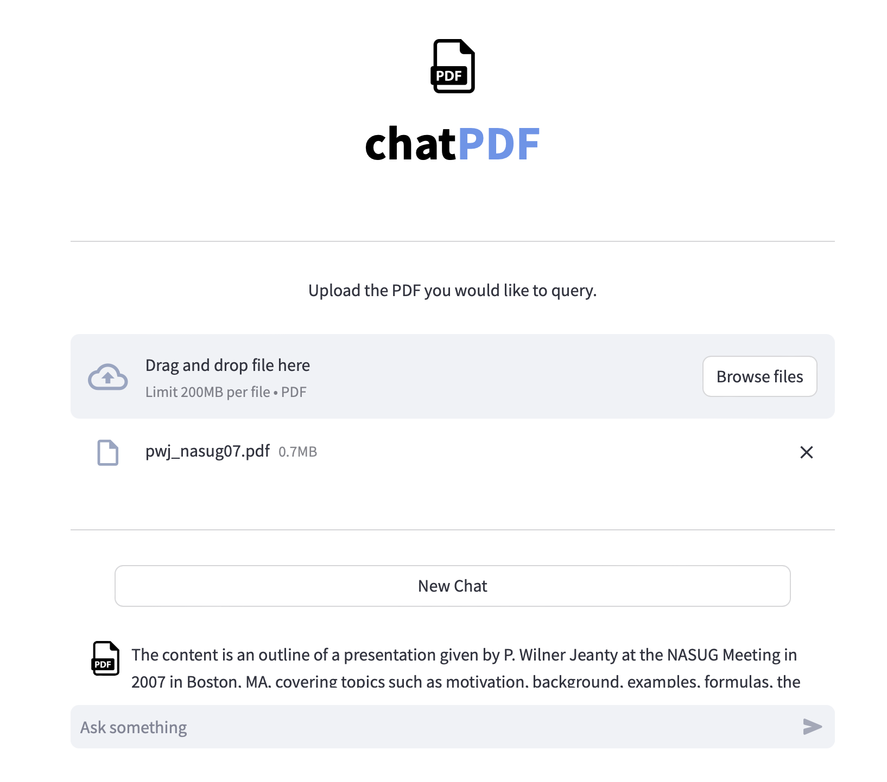

# chatPDF
Light weight Streamlit ChatBot for PDF query based on https://github.com/thoqbk/pdf-query.

## Solution
Uses LangChain and OpenAI to make your PDFs queryable.
- Split the file into smaller chunks that are smaller than the token limitation.
- Utilize vector databases such as `FAISS` or `Chroma` to store these chunks.
- Use LLM to search for related chunks in the database for each data retrieval request and summarize the information to obtain the final result.
- Frontend built with Streamlit




Refer to `chat.py` the details

## Run
Prerequisites:
- Python 3.6+
- [Virtualenv](https://docs.python.org/3/library/venv.html)

Open terminal, move to the root directory and run the folllowing commands:
```
python -m venv .env
source .env/bin/activate
pip install -r /path/to/requirements.txt
```
Note that,
- the first command is only needed to run once to create `.env` folder in the root directory for the same code
- the second command is to activate the virtual env, need to run at the beginning of the test session
- the last command is to install dependencies, need to run once unless there're changes in dependencies

Next steps:
- update `chat.py` to add your open-ai API key
```
os.environ["OPENAI_API_KEY"] = "YOUR-OPEN-AI-API-KEY"
```
- run the code and ask questions
```
> streamlit run chat.py 
```

